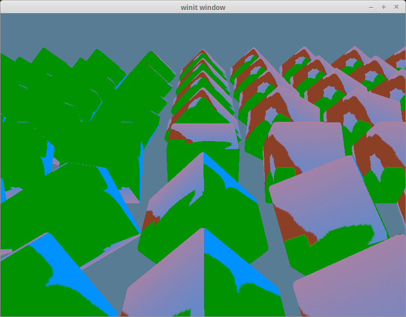
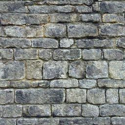
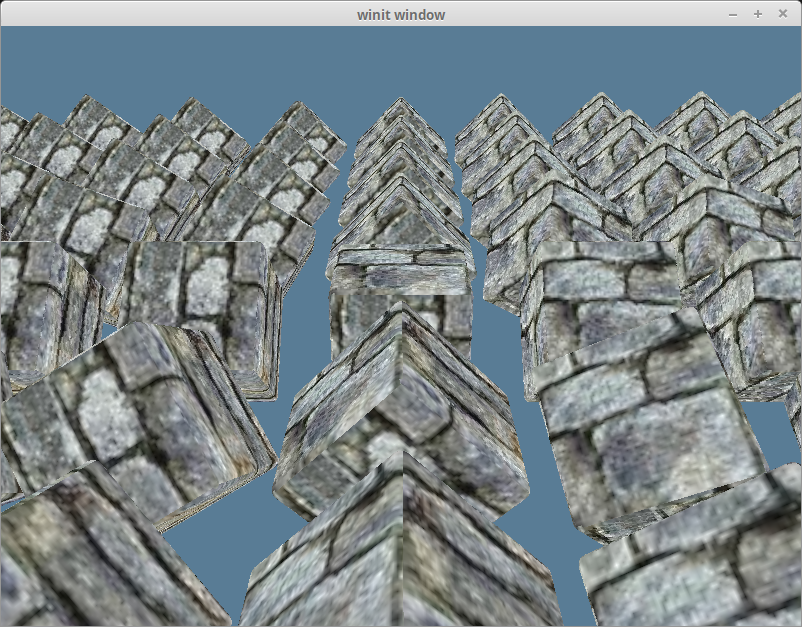

# Model Loading

Up to this point we've been creating our models manually. While this is an acceptable way to do this, but it's really slow if we want to include complex models with lots of polygons. Because of this, we're going modify our code to leverage the obj model format so that we can create a model in a software such as blender and display it in our code.

Our `main.rs` file is getting pretty cluttered, let's create a `model.rs` file that we can put our model loading code into.

```rust
// model.rs
pub trait Vertex {
    fn desc<'a>() -> wgpu::VertexBufferLayout<'a>;
}

#[repr(C)]
#[derive(Copy, Clone, Debug, bytemuck::Pod, bytemuck::Zeroable)]
pub struct ModelVertex {
    position: [f32; 3],
    tex_coords: [f32; 2],
    normal: [f32; 3],
}

impl Vertex for ModelVertex {
    fn desc<'a>() -> wgpu::VertexBufferLayout<'a> {
        todo!();
    }
}
```

You'll notice a couple of things here. In `main.rs` we had `Vertex` as a struct, here we're using a trait. We could have multiple vertex types (model, UI, instance data, etc.). Making `Vertex` a trait will allow us to abstract our the `VertexBufferLayout` creation code to make creating `RenderPipeline`s simpler.

Another thing to mention is the `normal` field in `ModelVertex`. We won't use this until we talk about lighting, but will add it to the struct for now.

Let's define our `VertexBufferLayout`.

```rust
impl Vertex for ModelVertex {
    fn desc<'a>() -> wgpu::VertexBufferLayout<'a> {
        use std::mem;
        wgpu::VertexBufferLayout {
            array_stride: mem::size_of::<ModelVertex>() as wgpu::BufferAddress,
            step_mode: wgpu::VertexStepMode::Vertex,
            attributes: &[
                wgpu::VertexAttribute {
                    offset: 0,
                    shader_location: 0,
                    format: wgpu::VertexFormat::Float32x3,
                },
                wgpu::VertexAttribute {
                    offset: mem::size_of::<[f32; 3]>() as wgpu::BufferAddress,
                    shader_location: 1,
                    format: wgpu::VertexFormat::Float32x2,
                },
                wgpu::VertexAttribute {
                    offset: mem::size_of::<[f32; 5]>() as wgpu::BufferAddress,
                    shader_location: 2,
                    format: wgpu::VertexFormat::Float32x3,
                },
            ],
        }
    }
}
```

This is basically the same as the original `VertexBufferLayout`, but we added a `VertexAttribute` for the `normal`. Remove the `Vertex` struct in `main.rs` as we won't need it anymore, and use our new `Vertex` from model for the `RenderPipeline`.

```rust
let render_pipeline = device.create_render_pipeline(&wgpu::RenderPipelineDescriptor {
    // ...
    vertex: wgpu::VertexState {
        // ...
        buffers: &[model::ModelVertex::desc(), InstanceRaw::desc()],
    },
    // ...
});
```

Since the `desc` method is implemented on the `Vertex` trait, the trait needs to be imported before the method will be accessible. Put the import towards the top of the file with the others.

```rust
use model::Vertex;
```

With all that in place we need a model to render. If you have one already that's great, but I've supplied a [zip file](https://github.com/sotrh/learn-wgpu/blob/master/code/beginner/tutorial9-models/res/cube.zip) with the model and all of it's textures. We're going to put this model in a new `res` folder next to the existing `src` folder.

## Accessing files in the res folder

When cargo builds and runs our program it sets what's known as the current working directory. This directory is usually the folder containing your projects root `Cargo.toml`. The path to our res folder may differ depending on the structure of the project. In the `res` folder for the example code for this section tutorial is at `code/beginner/tutorial9-models/res/`. When loading our model we could use this path, and just append `cube.obj`. This is fine, but if we change our projects structure, our code will break.

We're going to fix that by modifying our build script to copy our `res` folder to where cargo creates our executable, and we'll reference it from there. Create a file called `build.rs` and add the following:

```rust
use anyhow::*;
use fs_extra::copy_items;
use fs_extra::dir::CopyOptions;
use std::env;

fn main() -> Result<()> {
    // This tells cargo to rerun this script if something in /res/ changes.
    println!("cargo:rerun-if-changed=res/*");

    let out_dir = env::var("OUT_DIR")?;
    let mut copy_options = CopyOptions::new();
    copy_options.overwrite = true;
    let mut paths_to_copy = Vec::new();
    paths_to_copy.push("res/");
    copy_items(&paths_to_copy, out_dir, &copy_options)?;

    Ok(())
}
```

<div class="note">

Make sure to put `build.rs` in the same folder as the `Cargo.toml`. If you don't, cargo won't run it when your crate builds.

</div>

<div class="note">

The `OUT_DIR` is an environment variable that cargo uses to specify where our application will be built.

</div>

You'll need to modify your `Cargo.toml` for this to work properly. Add the following below your `[dependencies]` block.

```toml
[build-dependencies]
anyhow = "1.0"
fs_extra = "1.2"
glob = "0.3"
```

## Accessing files from WASM

By design, you can't access files on a users filesystem in Web Assembly. Instead we'll serve those files up using a web serve, and then load those files into our code using an http request. In order to simplify this, let's create a file called `resources.rs` to handle this for us. We'll create two functions that will load text files and binary files respectively.

```rust
use std::io::{BufReader, Cursor};

use cfg_if::cfg_if;
use wgpu::util::DeviceExt;

use crate::{model, texture};

#[cfg(target_arch = "wasm32")]
    fn format_url(file_name: &str) -> reqwest::Url {
    let window = web_sys::window().unwrap();
    let location = window.location();
    let base = reqwest::Url::parse(&format!(
        "{}/{}/",
        location.origin().unwrap(),
        option_env!("RES_PATH").unwrap_or("res"),
    )).unwrap();
    base.join(file_name).unwrap()
}

pub async fn load_string(file_name: &str) -> anyhow::Result<String> {
    cfg_if! {
        if #[cfg(target_arch = "wasm32")] {
            let url = format_url(file_name);
            let txt = reqwest::get(url)
                .await?
                .text()
                .await?;
        } else {
            let path = std::path::Path::new(env!("OUT_DIR"))
                .join("res")
                .join(file_name);
            let txt = std::fs::read_to_string(path)?;
        }
    }

    Ok(txt)
}

pub async fn load_binary(file_name: &str) -> anyhow::Result<Vec<u8>> {
    cfg_if! {
        if #[cfg(target_arch = "wasm32")] {
            let url = format_url(file_name);
            let data = reqwest::get(url)
                .await?
                .bytes()
                .await?
                .to_vec();
        } else {
            let path = std::path::Path::new(env!("OUT_DIR"))
                .join("res")
                .join(file_name);
            let data = std::fs::read(path)?;
        }
    }

    Ok(data)
}
```

<div class="note">

We're using `OUT_DIR` on desktop to get at our `res` folder.

</div>

I'm using [reqwest](https://docs.rs/reqwest) to handle loading the requests when using WASM. Add the following to the Cargo.toml:

```toml
[target.'cfg(target_arch = "wasm32")'.dependencies]
# Other dependencies
reqwest = { version = "0.11" }
```

We'll also need to add the `Location` feature to `web-sys`:

```toml
web-sys = { version = "0.3", features = [
    "Document",
    "Window",
    "Element",
    "Location",
]}
```

Make sure to add `resources` as a module in `lib.rs`:

```rust
mod resources;
```

## Loading models with TOBJ

We're going to use the [tobj](https://docs.rs/tobj/3.0/tobj/) library to load our model. Let's add it to our `Cargo.toml`.

```toml
[dependencies]
# other dependencies...
tobj = { version = "3.2.1", features = [
    "async",
]}
```

Before we can load our model though, we need somewhere to put it.

```rust
// model.rs
pub struct Model {
    pub meshes: Vec<Mesh>,
    pub materials: Vec<Material>,
}
```

You'll notice that our `Model` struct has a `Vec` for the `meshes`, and for `materials`. This is important as our obj file can include multiple meshes and materials. We still need to create the `Mesh` and `Material` classes, so let's do that.

```rust
pub struct Material {
    pub name: String,
    pub diffuse_texture: texture::Texture,
    pub bind_group: wgpu::BindGroup,
}

pub struct Mesh {
    pub name: String,
    pub vertex_buffer: wgpu::Buffer,
    pub index_buffer: wgpu::Buffer,
    pub num_elements: u32,
    pub material: usize,
}
```

The `Material` is pretty simple, it's just the name and one texture. Our cube obj actually has 2 textures, but one is a normal map, and we'll get to those [later](../../intermediate/tutorial11-normals). The name is more for debugging purposes.

Speaking of textures, we'll need to add a function to load a `Texture` in `resources.rs`.

```rust

pub async fn load_texture(
    file_name: &str,
    device: &wgpu::Device,
    queue: &wgpu::Queue,
) -> anyhow::Result<texture::Texture> {
    let data = load_binary(file_name).await?;
    texture::Texture::from_bytes(device, queue, &data, file_name)
}
```

The `load_texture` method will be useful when we load the textures for our models, as `include_bytes!` requires that we know the name of the file at compile time which we can't really guarantee with model textures.

`Mesh` holds a vertex buffer, an index buffer, and the number of indices in the mesh. We're using an `usize` for the material. This `usize` will be used to index the `materials` list when it comes time to draw.

With all that out of the way, we can get to loading our model.

```rust
pub async fn load_model(
    file_name: &str,
    device: &wgpu::Device,
    queue: &wgpu::Queue,
    layout: &wgpu::BindGroupLayout,
) -> anyhow::Result<model::Model> {
    let obj_text = load_string(file_name).await?;
    let obj_cursor = Cursor::new(obj_text);
    let mut obj_reader = BufReader::new(obj_cursor);

    let (models, obj_materials) = tobj::load_obj_buf_async(
        &mut obj_reader,
        &tobj::LoadOptions {
            triangulate: true,
            single_index: true,
            ..Default::default()
        },
        |p| async move {
            let mat_text = load_string(&p).await.unwrap();
            tobj::load_mtl_buf(&mut BufReader::new(Cursor::new(mat_text)))
        },
    )
    .await?;

    let mut materials = Vec::new();
    for m in obj_materials? {
        let diffuse_texture = load_texture(&m.diffuse_texture, device, queue).await?;
        let bind_group = device.create_bind_group(&wgpu::BindGroupDescriptor {
            layout,
            entries: &[
                wgpu::BindGroupEntry {
                    binding: 0,
                    resource: wgpu::BindingResource::TextureView(&diffuse_texture.view),
                },
                wgpu::BindGroupEntry {
                    binding: 1,
                    resource: wgpu::BindingResource::Sampler(&diffuse_texture.sampler),
                },
            ],
            label: None,
        });

        materials.push(model::Material {
            name: m.name,
            diffuse_texture,
            bind_group,
        })
    }

    let meshes = models
        .into_iter()
        .map(|m| {
            let vertices = (0..m.mesh.positions.len() / 3)
                .map(|i| model::ModelVertex {
                    position: [
                        m.mesh.positions[i * 3],
                        m.mesh.positions[i * 3 + 1],
                        m.mesh.positions[i * 3 + 2],
                    ],
                    tex_coords: [m.mesh.texcoords[i * 2], m.mesh.texcoords[i * 2 + 1]],
                    normal: [
                        m.mesh.normals[i * 3],
                        m.mesh.normals[i * 3 + 1],
                        m.mesh.normals[i * 3 + 2],
                    ],
                })
                .collect::<Vec<_>>();

            let vertex_buffer = device.create_buffer_init(&wgpu::util::BufferInitDescriptor {
                label: Some(&format!("{:?} Vertex Buffer", file_name)),
                contents: bytemuck::cast_slice(&vertices),
                usage: wgpu::BufferUsages::VERTEX,
            });
            let index_buffer = device.create_buffer_init(&wgpu::util::BufferInitDescriptor {
                label: Some(&format!("{:?} Index Buffer", file_name)),
                contents: bytemuck::cast_slice(&m.mesh.indices),
                usage: wgpu::BufferUsages::INDEX,
            });

            model::Mesh {
                name: file_name.to_string(),
                vertex_buffer,
                index_buffer,
                num_elements: m.mesh.indices.len() as u32,
                material: m.mesh.material_id.unwrap_or(0),
            }
        })
        .collect::<Vec<_>>();

    Ok(model::Model { meshes, materials })
}

```

## Rendering a mesh

Before we can draw the model, we need to be able to draw an individual mesh. Let's create a trait called `DrawModel`, and implement it for `RenderPass`.

```rust
// model.rs
pub trait DrawModel<'a> {
    fn draw_mesh(&mut self, mesh: &'a Mesh);
    fn draw_mesh_instanced(
        &mut self,
        mesh: &'a Mesh,
        instances: Range<u32>,
    );
}
impl<'a, 'b> DrawModel<'b> for wgpu::RenderPass<'a>
where
    'b: 'a,
{
    fn draw_mesh(&mut self, mesh: &'b Mesh) {
        self.draw_mesh_instanced(mesh, 0..1);
    }

    fn draw_mesh_instanced(
        &mut self,
        mesh: &'b Mesh,
        instances: Range<u32>,
    ){
        self.set_vertex_buffer(0, mesh.vertex_buffer.slice(..));
        self.set_index_buffer(mesh.index_buffer.slice(..), wgpu::IndexFormat::Uint32);
        self.draw_indexed(0..mesh.num_elements, 0, instances);
    }
}
```

We could have put this methods in an `impl Model`, but I felt it made more sense to have the `RenderPass` do all the rendering, as that's kind of it's job. This does mean we have to import `DrawModel` when we go to render though.

```rust
// lib.rs
render_pass.set_vertex_buffer(1, self.instance_buffer.slice(..));
render_pass.set_pipeline(&self.render_pipeline);
render_pass.set_bind_group(0, &self.diffuse_bind_group, &[]);
render_pass.set_bind_group(1, &self.camera_bind_group, &[]);

use model::DrawModel;
render_pass.draw_mesh_instanced(&self.obj_model.meshes[0], 0..self.instances.len() as u32);
```

Before that though we need to actually load the model and save it to `State`. Put the following in `State::new()`.

```rust
let obj_model = resources::load_model(
    "cube.obj",
    &device,
    &queue,
    &texture_bind_group_layout,
).await.unwrap();
```

Our new model is a bit bigger than our previous one so we're gonna need to adjust the spacing on our instances a bit.

```rust
const SPACE_BETWEEN: f32 = 3.0;
let instances = (0..NUM_INSTANCES_PER_ROW).flat_map(|z| {
    (0..NUM_INSTANCES_PER_ROW).map(move |x| {
        let x = SPACE_BETWEEN * (x as f32 - NUM_INSTANCES_PER_ROW as f32 / 2.0);
        let z = SPACE_BETWEEN * (z as f32 - NUM_INSTANCES_PER_ROW as f32 / 2.0);

        let position = cgmath::Vector3 { x, y: 0.0, z };

        let rotation = if position.is_zero() {
            cgmath::Quaternion::from_axis_angle(cgmath::Vector3::unit_z(), cgmath::Deg(0.0))
        } else {
            cgmath::Quaternion::from_axis_angle(position.normalize(), cgmath::Deg(45.0))
        };

        Instance {
            position, rotation,
        }
    })
}).collect::<Vec<_>>();
```

With all that done, you should get something like this.



## Using the correct textures

If you look at the texture files for our obj, you'll see that they don't match up to our obj. The texture we want to see is this one,



but we're still getting our happy tree texture.

The reason for this is quite simple. Though we've created our textures we haven't created a bind group to give to the `RenderPass`. We're still using our old `diffuse_bind_group`. If we want to change that we need to use the bind group from our materials - the `bind_group` member of the `Material` struct.

We're going to add a material parameter to `DrawModel`.

```rust
pub trait DrawModel<'a> {
    fn draw_mesh(&mut self, mesh: &'a Mesh, material: &'a Material, camera_bind_group: &'a wgpu::BindGroup);
    fn draw_mesh_instanced(
        &mut self,
        mesh: &'a Mesh,
        material: &'a Material,
        instances: Range<u32>,
        camera_bind_group: &'a wgpu::BindGroup,
    );

}

impl<'a, 'b> DrawModel<'b> for wgpu::RenderPass<'a>
where
    'b: 'a,
{
    fn draw_mesh(&mut self, mesh: &'b Mesh, material: &'b Material, camera_bind_group: &'b wgpu::BindGroup) {
        self.draw_mesh_instanced(mesh, material, 0..1, camera_bind_group);
    }

    fn draw_mesh_instanced(
        &mut self,
        mesh: &'b Mesh,
        material: &'b Material,
        instances: Range<u32>,
        camera_bind_group: &'b wgpu::BindGroup,
    ) {
        self.set_vertex_buffer(0, mesh.vertex_buffer.slice(..));
        self.set_index_buffer(mesh.index_buffer.slice(..), wgpu::IndexFormat::Uint32);
        self.set_bind_group(0, &material.bind_group, &[]);
        self.set_bind_group(1, camera_bind_group, &[]);
        self.draw_indexed(0..mesh.num_elements, 0, instances);
    }
}
```

We need to change the render code to reflect this.

```rust
render_pass.set_vertex_buffer(1, self.instance_buffer.slice(..));

render_pass.set_pipeline(&self.render_pipeline);

let mesh = &self.obj_model.meshes[0];
let material = &self.obj_model.materials[mesh.material];
render_pass.draw_mesh_instanced(mesh, material, 0..self.instances.len() as u32, &self.camera_bind_group);
```

With all that in place we should get the following.



## Rendering the entire model

Right now we are specifying the mesh and the material directly. This is useful if we want to draw a mesh with a different material. We're also not rendering other parts of the model (if we had some). Let's create a method for `DrawModel` that will draw all the parts of the model with their respective materials.

```rust
pub trait DrawModel<'a> {
    // ...
    fn draw_model(&mut self, model: &'a Model, camera_bind_group: &'a wgpu::BindGroup);
    fn draw_model_instanced(
        &mut self,
        model: &'a Model,
        instances: Range<u32>,
        camera_bind_group: &'a wgpu::BindGroup,
    );
}

impl<'a, 'b> DrawModel<'b> for wgpu::RenderPass<'a>
where
    'b: 'a, {
    // ...
    fn draw_model(&mut self, model: &'b Model, camera_bind_group: &'b wgpu::BindGroup) {
        self.draw_model_instanced(model, 0..1, camera_bind_group);
    }

    fn draw_model_instanced(
        &mut self,
        model: &'b Model,
        instances: Range<u32>,
        camera_bind_group: &'b wgpu::BindGroup,
    ) {
        for mesh in &model.meshes {
            let material = &model.materials[mesh.material];
            self.draw_mesh_instanced(mesh, material, instances.clone(), camera_bind_group);
        }
    }
}
```

The code in `main.rs` will change accordingly.

```rust
render_pass.set_vertex_buffer(1, self.instance_buffer.slice(..));
render_pass.set_pipeline(&self.render_pipeline);
render_pass.draw_model_instanced(&self.obj_model, 0..self.instances.len() as u32, &self.camera_bind_group);
```

<WasmExample example="tutorial9_models"></WasmExample>

<AutoGithubLink/>
