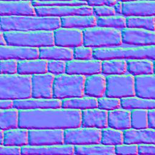
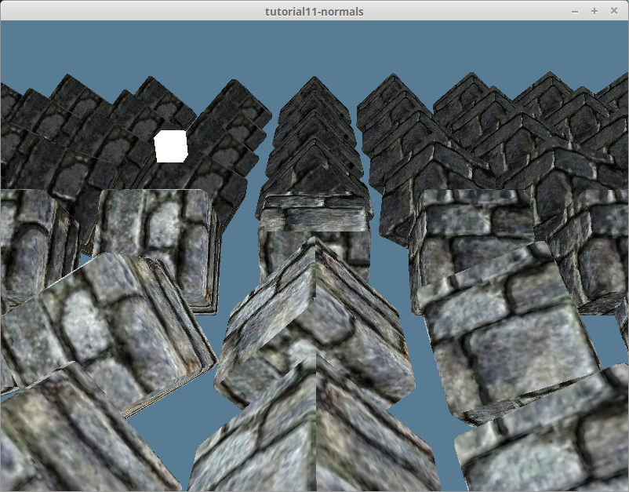
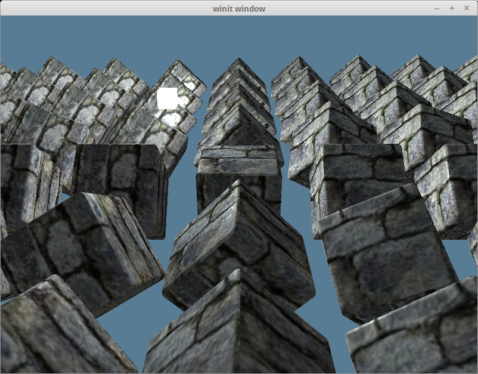
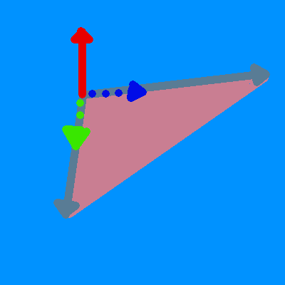
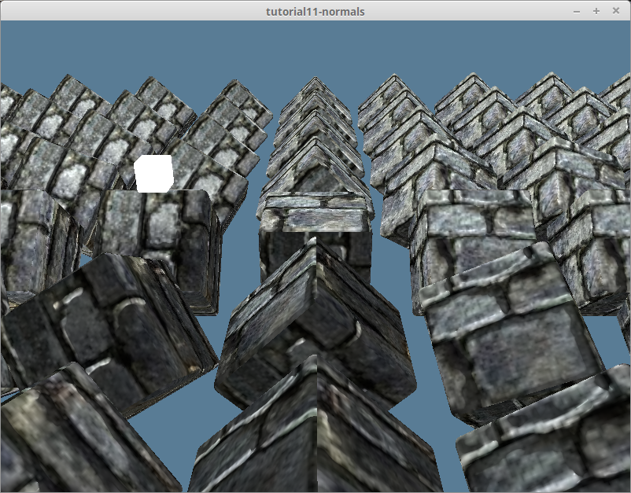
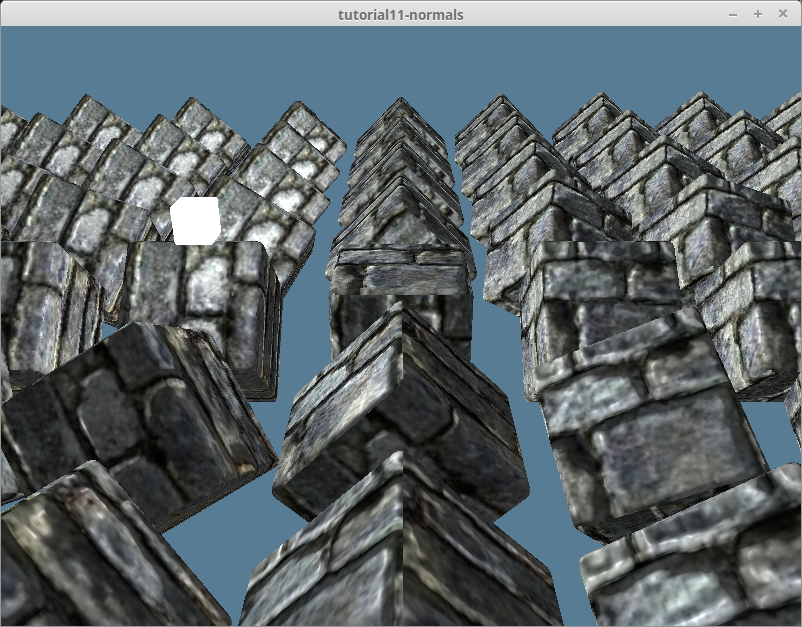
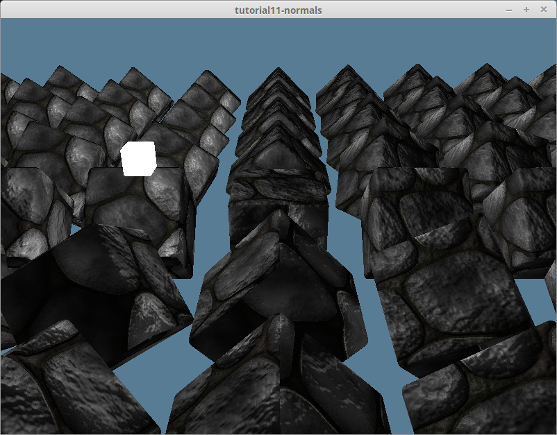

# Normal Mapping

With just lighting, our scene is already looking pretty good. Still, our models are still overly smooth. This is understandable because we are using a very simple model. If we were using a texture that was supposed to be smooth, this wouldn't be a problem, but our brick texture is supposed to be rougher. We could solve this by adding more geometry, but that would slow our scene down, and it would hard to know where to add new polygons. This is were normal mapping comes in.

Remember in [the instancing tutorial](/beginner/tutorial7-instancing/#a-different-way-textures), we experimented with storing instance data in a texture? A normal map is doing just that with normal data! We'll use the normals in the normal map in our lighting calculation in addition to the vertex normal.

The brick texture I found came with a normal map. Let's take a look at it!



The r, g, and b components of the texture correspond to the x, y, and z components or the normals. All the z values should be positive, that's why the normal map has a bluish tint.

We'll need to modify our `Material` struct in `model.rs` to include a `normal_texture`.

```rust
pub struct Material {
    pub name: String,
    pub diffuse_texture: texture::Texture,
    pub normal_texture: texture::Texture,
    pub bind_group: wgpu::BindGroup,
}
```

We'll have to update the `texture_bind_group_layout` to include the normal map as well.

```rust
let texture_bind_group_layout = device.create_bind_group_layout(&wgpu::BindGroupLayoutDescriptor {
    entries: &[
        // ...
        // normal map
        wgpu::BindGroupLayoutEntry {
            binding: 2,
            visibility: wgpu::ShaderStage::FRAGMENT,
            ty: wgpu::BindingType::Texture {
                multisampled: false,
                sample_type: wgpu::TextureSampleType::Float { filterable: true },
                view_dimension: wgpu::TextureViewDimension::D2,
            },
            count: None,
        },
        wgpu::BindGroupLayoutEntry {
            binding: 3,
            visibility: wgpu::ShaderStage::FRAGMENT,
            ty: wgpu::BindingType::Sampler { 
                comparison: false,
                filtering: true, 
            },
            count: None,
        },
    ],
    label: Some("texture_bind_group_layout"),
});
```

We'll need to actually the normal map itself. We'll do this in the loop we create the materials in.

```rust
    let diffuse_path = mat.diffuse_texture;
    let diffuse_texture = texture::Texture::load(device, queue, containing_folder.join(diffuse_path))?;
    
    let normal_path = mat.normal_texture;
    let normal_texture = texture::Texture::load(device, queue, containing_folder.join(normal_path))?;

```

* Note: I duplicated and moved teh `command_buffers.push(cmds);` line. This means we can reuse the `cmds` variable for both the normal map and diffuse/color map.

Our `Material`'s `bind_group` will have to change as well. 

```rust
let bind_group = device.create_bind_group(&wgpu::BindGroupDescriptor {
    layout,
    entries: &[
        // ...
        wgpu::BindGroupEntry {
            binding: 2,
            resource: wgpu::BindingResource::TextureView(&normal_texture.view),
        },
        wgpu::BindGroupEntry {
            binding: 3,
            resource: wgpu::BindingResource::Sampler(&normal_texture.sampler),
        },
    ],
    label: None,
});
```

Don't forget to pass the `normal_texture` into the `Material` struct!

```rust
materials.push(Material {
    name: mat.name,
    diffuse_texture,
    normal_texture, // NEW!
    bind_group,
});
```

Now we can add use the texture in the fragment shader.

```glsl
// shader.frag
// ...

layout(set = 0, binding = 2) uniform texture2D t_normal;
layout(set = 0, binding = 3) uniform sampler s_normal;

// ...

void main() {
    vec4 object_color = texture(sampler2D(t_diffuse, s_diffuse), v_tex_coords);
    vec4 object_normal = texture(sampler2D(t_normal, s_normal), v_tex_coords); // NEW!

    // ...

    vec3 normal = normalize(object_normal.rgb * 2.0 - 1.0); // UPDATED!
    
    // ...
}
```

If we run the code now, you'll notice things don't look quite right. Let's compare our results with the last tutorial.




Parts of the scene are dark when they should be lit up, and vice versa.

## Tangent Space to World Space

I mentioned it briefly in the [lighting tutorial](/intermediate/tutorial10-lighting/#the-normal-matrix), that we were doing our lighting calculation in "world space". This meant that the entire scene was oriented with respect to the *world's* coordinate system. When we pull the normal data from our normal texture, all the normals are in what's known as  pointing roughly in the positive z direction. That means that our lighting calculation thinks all of the surfaces of our models are facing in roughly the same direction. This is referred to as `tangent space`.

If we remember the [lighting-tutorial](/intermediate/tutorial10-lighting/#), we used the vertex normal to indicate the direction of the surface. It turns out we can use that to transform our normals from `tangent space` into `world space`. In order to do that we need to draw from the depths of linear algebra.

We can create a matrix that represents a coordinate system using 3 vectors that are perpendicular (or orthonormal) to each other. Basically we define the x, y, and z axes of our coordinate system.

```glsl
mat3 coordinate_system = mat3(
    vec3(1, 0, 0), // x axis (right)
    vec3(0, 1, 0), // y axis (up)
    vec3(0, 0, 1)  // z axis (forward)
);
```

We're going to create a matrix that will represent the coordinate space relative to our vertex normals. We're then going to use that to transform our normal map data to be in world space. 

## The tangent, and the bitangent

We have one of the 3 vectors we need, the normal. What about the others? These are the tangent, and bitangent vectors. A tangent represents any vector that is parallel with a surface (aka. doesn't intersect with it). The tangent is always perpendicular to the normal vector. The bitangent is a tangent vector that is perpendicular to the other tangent vector. Together the tangent, bitangent, and normal represent the x, y, and z axes respectively.

Some model formats include the tanget and bitangent (sometimes called the binormal) in the vertex data, but OBJ does not. We'll have to calculate them manually. Luckily we can derive our tangent, and bitangent from our existing vertex data. Take a look at the following diagram.



Basically we can use the edges of our triangles, and our normal to calculate the tangent and bitangent. But first, we need to update our `ModelVertex` struct in `model.rs`.

```rust
#[repr(C)]
#[derive(Copy, Clone, Debug, bytemuck::Pod, bytemuck::Zeroable)]
pub struct ModelVertex {
    // Use cgmath to simplify the tangent, bitanget
    // calculation. You can't add and subtract [f32; 3]
    // without implementing such traits by yourself.
    position: cgmath::Vector3<f32>,
    tex_coords: cgmath::Vector2<f32>,
    normal: cgmath::Vector3<f32>,
    // NEW!
    tangent: [f32; 3],
    bitangent: [f32; 3],
}
```

We'll need to upgrade our `VertexBufferLayout` as well.

```rust
impl Vertex for ModelVertex {
    fn desc<'a>() -> wgpu::VertexBufferLayout<'a> {
        use std::mem;
        wgpu::VertexBufferLayout {
            array_stride: mem::size_of::<ModelVertex>() as wgpu::BufferAddress,
            step_mode: wgpu::InputStepMode::Vertex,
            attributes: &[
                // ...

                // Tangent and bitangent
                wgpu::VertexAttribute {
                    offset: mem::size_of::<[f32; 8]>() as wgpu::BufferAddress,
                    shader_location: 3,
                    format: wgpu::VertexFormat::Float3,
                },
                wgpu::VertexAttribute {
                    offset: mem::size_of::<[f32; 11]>() as wgpu::BufferAddress,
                    shader_location: 4,
                    format: wgpu::VertexFormat::Float3,
                },
            ],
        }
    }
}
```

Now we can calculate the new tangent, and bitangent vectors.

```rust
impl Model {
    pub fn load<P: AsRef<Path>>(
        device: &wgpu::Device,
        queue: &wgpu::Queue,
        layout: &wgpu::BindGroupLayout,
        path: P,
    ) -> Result<(Self, Vec<wgpu::CommandBuffer>), failure::Error> {
        // ...
        for m in obj_models {
            let mut vertices = Vec::new();
            for i in 0..m.mesh.positions.len() / 3 {
                vertices.push(ModelVertex {
                    // Add .into() to convert arrays to cgmath::VectorN
                    position: [
                        // ...
                    ].into(),
                    tex_coords: [
                        // ...
                    ].into(),
                    normal: [
                        // ...
                    ].into(),
                    // ...
                    // We'll calculate these later
                    tangent: [0.0; 3].into(),
                    bitangent: [0.0; 3].into(),
                });
            }

            let indices = &m.mesh.indices;

            // Calculate tangents and bitangets. We're going to
            // use the triangles, so we need to loop through the
            // indices in chunks of 3
            for c in indices.chunks(3) {
                let v0 = vertices[c[0] as usize];
                let v1 = vertices[c[1] as usize];
                let v2 = vertices[c[2] as usize];

                let pos0: cgmath::Vector3<_> = v0.position.into();
                let pos1: cgmath::Vector3<_> = v1.position.into();
                let pos2: cgmath::Vector3<_> = v2.position.into();

                let uv0: cgmath::Vector2<_> = v0.tex_coords.into();
                let uv1: cgmath::Vector2<_> = v1.tex_coords.into();
                let uv2: cgmath::Vector2<_> = v2.tex_coords.into();

                // Calculate the edges of the triangle
                let delta_pos1 = pos1 - pos0;
                let delta_pos2 = pos2 - pos0;

                // This will give us a direction to calculate the
                // tangent and bitangent
                let delta_uv1 = uv1 - uv0;
                let delta_uv2 = uv2 - uv0;

                // Solving the following system of equations will
                // give us the tangent and bitangent.
                //     delta_pos1 = delta_uv1.x * T + delta_u.y * B
                //     delta_pos2 = delta_uv2.x * T + delta_uv2.y * B
                // Luckily, the place I found this equation provided 
                // the solution!
                let r = 1.0 / (delta_uv1 .x * delta_uv2.y - delta_uv1.y * delta_uv2.x);
                let tangent = (delta_pos1 * delta_uv2.y - delta_pos2 * delta_uv1.y) * r;
                let bitangent = (delta_pos2 * delta_uv1.x - delta_pos1 * delta_uv2.x) * r;
                
                // We'll use the same tangent/bitangent for each vertex in the triangle
                vertices[c[0] as usize].tangent = tangent.into();
                vertices[c[1] as usize].tangent = tangent.into();
                vertices[c[2] as usize].tangent = tangent.into();

                vertices[c[0] as usize].bitangent = bitangent.into();
                vertices[c[1] as usize].bitangent = bitangent.into();
                vertices[c[2] as usize].bitangent = bitangent.into();
            }

            // ...
        }

        Ok((Self { meshes, materials }, command_buffers))
    }
}
```

## Shader time!

The fragment shader needs to be updated to include our tangent and bitangent.

```glsl
// shader.vert
layout(location=0) in vec3 a_position;
layout(location=1) in vec2 a_tex_coords;
layout(location=2) in vec3 a_normal;
// NEW!
layout(location=3) in vec3 a_tangent;
layout(location=4) in vec3 a_bitangent;
```

We're going to change up the output variables as well. We're going to calculate a `tangent_matrix` that we're going to pass to the fragment shader. We're also going to remove `v_normal` as we will be using the normal map data instead.

```glsl
layout(location=0) out vec2 v_tex_coords;
layout(location=1) out vec3 v_position; // UPDATED!
layout(location=2) out mat3 v_tangent_matrix; // NEW!

// ...

void main() {
    // ...
    vec3 normal = normalize(normal_matrix * a_normal);
    vec3 tangent = normalize(normal_matrix * a_tangent);
    vec3 bitangent = normalize(normal_matrix * a_bitangent);
    
    v_tangent_matrix = transpose(mat3(
        tangent,
        bitangent,
        normal
    ));
    // ...
}
```

We need to reflect these updates in the fragment shader as well. We'll also transform the normal into `world space`.

```glsl
// shader.frag
layout(location=0) in vec2 v_tex_coords;
layout(location=1) in vec3 v_position; // UPDATED!
layout(location=2) in mat3 v_tangent_matrix; // NEW!

// ...

void main() {
    // ...
    vec3 normal = normalize(v_tangent_matrix * (object_normal.rgb * 2.0 - 1.0));
    // ...
}
```

With that we get the following.



## Eww, matrix multiplication in the fragment shader...

Currently we are transforming the normal in the fragment shader. The fragment shader gets run for **every pixel**. To say this is inefficient is an understatement. Even so, we can't do the transformation in the vertex shader since we need to sample the normal map in the pixel shader. If want to use the `tangent_matrix` out of the fragment shader, we're going to have to think outside the box.

## World Space to Tangent Space

The variables we're using in the lighting calculation are `v_position`, `light_position`, and `u_view_position`. These are in `world space` while our normals are in `tangent space`. We can convert from `world space` to `tangent space` by multiplying by the inverse of the `tangent_matrix`. The inverse operation is a little expensive, but because our `tangent_matrix` is made up of vectors that are perpendicular to each other (aka. orthonormal), we can use the `transpose()` function instead!

But first, we need to change up our output variables, and import the `Light` uniforms.

```glsl
// ...
layout(location=0) out vec2 v_tex_coords;
layout(location=1) out vec3 v_position; // UPDATED!
layout(location=2) out vec3 v_light_position; // NEW!
layout(location=3) out vec3 v_view_position; // NEW!
// ...

// NEW!
layout(set=2, binding=0) uniform Light {
    vec3 light_position;
    vec3 light_color;
};
```

Now we'll convert the other lighting values as follows.

```glsl
void main() {
    // ...

    // UDPATED!
    mat3 tangent_matrix = transpose(mat3(
        tangent,
        bitangent,
        normal
    ));

    vec4 model_space = model_matrix * vec4(a_position, 1.0);
    v_position = model_space.xyz;

    // NEW!
    v_position = tangent_matrix * model_space.xyz;
    v_light_position = tangent_matrix * light_position;
    v_view_position = tangent_matrix * u_view_position;
    // ...
}
```

Finally we'll update `shader.frag` to import and use the transformed lighting values.

```glsl
#version 450

layout(location=0) in vec2 v_tex_coords;
layout(location=1) in vec3 v_position; // UPDATED!
layout(location=2) in vec3 v_light_position; // NEW!
layout(location=3) in vec3 v_view_position; // NEW!
// ...
void main() {
    // ...

    vec3 normal = normalize(object_normal.rgb); // UPDATED!
    vec3 light_dir = normalize(v_light_position - v_position); // UPDATED!
    // ...

    vec3 view_dir = normalize(v_view_position - v_position); // UPDATED!
    // ...
}
```

The resulting image isn't noticeably different so I won't show it here, but the calculation definitely is more efficient.

## Srgb and normal textures

We've been using `Rgba8UnormSrgb` for all our textures. The `Srgb` bit specifies that we will be using [standard red green blue color space](https://en.wikipedia.org/wiki/SRGB). This is also known as linear color space. Linear color space has less color density. Even so, it is often used for diffuse textures, as they are typically made in `Srgb` color space.

Normal textures aren't made with `Srgb`. Using `Rgba8UnormSrgb` can changes how the GPU samples the texture. This can make the resulting simulation [less accurate](https://medium.com/@bgolus/generating-perfect-normal-maps-for-unity-f929e673fc57#b86c). We can avoid these issues by using `Rgba8Unorm` when we create the texture. Let's add an `is_normal_map` method to our `Texture` struct.

```rust
pub fn from_image(
    device: &wgpu::Device,
    queue: &wgpu::Queue,
    img: &image::DynamicImage,
    label: Option<&str>,
    is_normal_map: bool, // NEW!
) -> Result<(Self, wgpu::CommandBuffer), failure::Error> {
    // ...
    let texture = device.create_texture(&wgpu::TextureDescriptor {
        label,
        size,
        array_layer_count: 1,
        mip_level_count: 1,
        sample_count: 1,
        dimension: wgpu::TextureDimension::D2,
        // UPDATED!
        format: if is_normal_map {
            wgpu::TextureFormat::Rgba8Unorm
        } else {
            wgpu::TextureFormat::Rgba8UnormSrgb
        },
        usage: wgpu::TextureUsage::SAMPLED | wgpu::TextureUsage::COPY_DST,
    });

    // ...
    
    Ok((Self { texture, view, sampler }, cmd_buffer))
}
```

We'll need to propagate this change to the other methods that use this.

```rust
pub fn load<P: AsRef<Path>>(
    device: &wgpu::Device,
    queue: &wgpu::Queue,
    path: P,
    is_normal_map: bool, // NEW!
) -> Result<(Self, wgpu::CommandBuffer), failure::Error> {
    // ...
    let img = image::open(path)?;
    Self::from_image(device, queue, &img, label, is_normal_map) // UPDATED!
}

// ...

#[allow(dead_code)]
pub fn from_bytes(
    device: &wgpu::Device,
    queue: &wgpu::Queue,
    bytes: &[u8], 
    label: &str, 
    is_normal_map: bool, // NEW!
) -> Result<(Self, wgpu::CommandBuffer), failure::Error> {
    let img = image::load_from_memory(bytes)?;
    Self::from_image(device, &img, Some(label), is_normal_map)
}
```

We need to update `model.rs` as well.

```rust
let diffuse_path = mat.diffuse_texture;
// UPDATED!
let diffuse_texture = texture::Texture::load(device, queue, containing_folder.join(diffuse_path), false)?;

let normal_path = mat.normal_texture;
// UPDATED!
let normal_texture = texture::Texture::load(device, queue, containing_folder.join(normal_path), true)?;
```

That gives us the following.



## Unrelated stuff

While I was debugging the normal mapping code, I made a few changes to `model.rs` that I haven't mentioned. I wanted to be able to see the model with different textures, so I modified the `Material` struct to have a `new()` method.

```rust

impl Material {
    pub fn new(
        device: &wgpu::Device,
        name: &str, 
        diffuse_texture: texture::Texture, 
        normal_texture: texture::Texture,
        layout: &wgpu::BindGroupLayout,
    ) -> Self {
        let bind_group = device.create_bind_group(&wgpu::BindGroupDescriptor {
            layout,
            entries: &[
                wgpu::BindGroupEntry {
                    binding: 0,
                    resource: wgpu::BindingResource::TextureView(&diffuse_texture.view),
                },
                wgpu::BindGroupEntry {
                    binding: 1,
                    resource: wgpu::BindingResource::Sampler(&diffuse_texture.sampler),
                },
                wgpu::BindGroupEntry {
                    binding: 2,
                    resource: wgpu::BindingResource::TextureView(&normal_texture.view),
                },
                wgpu::BindGroupEntry {
                    binding: 3,
                    resource: wgpu::BindingResource::Sampler(&normal_texture.sampler),
                },
            ],
            label: Some(name),
        });

        Self { 
            name: String::from(name),
            diffuse_texture,
            normal_texture,
            bind_group,
        }
    }
}
```

This simplifies the code in `Model::load()`.

```rust
let mut materials = Vec::new();
for mat in obj_materials {
    let diffuse_path = mat.diffuse_texture;
    let diffuse_texture = texture::Texture::load(device, queue, containing_folder.join(diffuse_path), false)?;
    
    let normal_path = mat.normal_texture;
    let normal_texture = texture::Texture::load(device, queue, containing_folder.join(normal_path), true)?;

    materials.push(Material::new(
        device,
        &mat.name,
        diffuse_texture,
        normal_texture,
        layout,
    ));
}
```

I also added a `draw_model_instanced_with_material()` to the `DrawModel` trait.

```rust
pub trait DrawModel<'a, 'b>
where
    'b: 'a,
{
    // ...
    fn draw_model_instanced_with_material(
        &mut self,
        model: &'b Model,
        material: &'b Material,
        instances: Range<u32>,
        uniforms: &'b wgpu::BindGroup,
        light: &'b wgpu::BindGroup,
    );
}

impl<'a, 'b> DrawModel<'a, 'b> for wgpu::RenderPass<'a>
where
    'b: 'a,
{
    // ...
    fn draw_model_instanced_with_material(
        &mut self,
        model: &'b Model,
        material: &'b Material,
        instances: Range<u32>,
        uniforms: &'b wgpu::BindGroup,
        light: &'b wgpu::BindGroup,
    ) {
        for mesh in &model.meshes {
            self.draw_mesh_instanced(mesh, material, instances.clone(), uniforms, light);
        }
    }
}
```

I found a cobblestone texture with matching normal map, and created a `debug_material` for that.

```rust
// new()
let debug_material = {
    let diffuse_bytes = include_bytes!("../res/cobble-diffuse.png");
    let normal_bytes = include_bytes!("../res/cobble-normal.png");

    let diffuse_texture = texture::Texture::from_bytes(&device, &queue, diffuse_bytes, "res/alt-diffuse.png", false).unwrap();
    let normal_texture = texture::Texture::from_bytes(&device, &queue, normal_bytes, "res/alt-normal.png", true).unwrap();
    
    model::Material::new(&device, "alt-material", diffuse_texture, normal_texture, &texture_bind_group_layout)
};
Self {
    // ...
    #[allow(dead_code)]
    debug_material,
}
```

Then to render with the `debug_material` I used the `draw_model_instanced_with_material()` that I created.

```rust
render_pass.set_pipeline(&self.render_pipeline);
render_pass.draw_model_instanced_with_material(
    &self.obj_model,
    &self.debug_material,
    0..self.instances.len() as u32,
    &self.uniform_bind_group,
    &self.light_bind_group,
);
```

That gives us something like this.



You can find the textures I use in the Github Repository.

<AutoGithubLink/>
