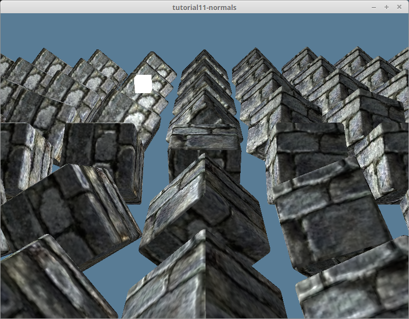

# News **UPDATED!**

## Normal mapping

My perfectionism got in my way a bit with this one. I wasn't sure that what I was getting was "physically accurate", but it seems to look good.



## 0.5!

To many things changed to make note of them here. Check out [the 0.5 pull request](https://github.com/sotrh/learn-wgpu/pull/29) if you're curious about specifics. That being said, 2 things are worth mentioning directly: the y-axis now points up like with DirectX and Metal, and requesting an adapter and creating a device now use `Future`s. The tutorials have been updated as well as the code.

## Reworked lighting tutorial

The [lighting tutorial](/intermediate/tutorial10-lighting/) was not up to par, so I redid it.

## Added GIF showcase

[Creating GIFs](/showcase/gifs/)

## Updated texture tutorials

Up to this point, we created textures manually everytime. I've pulled out the texture creation code into a new `texture.rs` file and included it every tutorial from the [textures tutorial](/beginner/tutorial5-textures/#cleaning-things-up) onward.

## Fixed panics do to not specifying the correct `usage`

Wgpu has become more strict about what `BufferUsage`s and `TextureUsage`s are required when performing certain operations. For example int the [Wgpu without a window example](/intermediate/windowless/), the `texture_desc` only specified the usage to by `COPY_SRC`. This caused a crash when the `texture` was used as a render target. Adding `OUTPUT_ATTACHMENT` fixed the issue.

## Updating Winit from 0.20.0-alpha5 to 0.20

There were a lot of small changes to how the dpi stuff works. You can see all the changes [in the changelog](https://github.com/rust-windowing/winit/blob/master/CHANGELOG.md). That means that some of the tutorials had to change.

* I've removed `hidpi_factor` from `State` entirely. They removed the `hidpi_factor()` method from `winit::window::Window`, and changed `inner_size()` to return `PhysicalSize` instead of `LogicalSize`, so we don't need to store the `hidpi_factor` anymore.
* `update_hidpi_and_resize` is no more. Since `ScaleFactorChanged` passes in the windows new `PhysicalSize`, we can simply use `resize()`.
* `State::size` is now `PhysicalSize<u32>` instead of the pre 0.20 `LogicalSize`.
* `EventsCleared` is now `MainEventsCleared`.

I may have missed a change, but I made sure that all the examples compile an run, so if you have trouble with your code you can use them as a reference.

## Changed tutorial examples to use a src directory

I wasn't using the traditional cargo binary folder setup. I've changed it to the standardized form now.


## Updating to 0.4 from 0.3
There are a few things that have changed:
1. The use of `Instance` has been removed. Creating a `Surface` and requesting an `Adapter` are done as follows.
```rust
let surface = wgpu::Surface::create(window);
let adapter = wgpu::Adapter::request(&wgpu::RequestAdapterOptions {
    ..Default::default()
}).unwrap(); // needs to be unwrapped
```
2. The `request_device` method now returns a `(Device, Queue)` tuple. This means that you can borrow the `Queue` mutably while using the `Device` immutably. Because of this change, submitting `CommandBuffer`s to the queue uses the `submit` method on the `Queue` directly.
```rust
self.queue.submit(&[
    encoder.finish()
]);
```
3. The `create` method on `Surface` takes in any struct that implements the `HasRawWindow` trait, instead of a `RawWindowHandle`. This means that the `raw-window-handle = "0.3"` line in `Cargo.toml` is no longer needed.

I don't know if this is a change from 0.4, but you use `wgpu = "0.4"` line in dependencies instead of the `[dependencies.wgpu]` as wgpu will determine the best back end for you.


## New/Recent Articles
<RecentArticles/>

