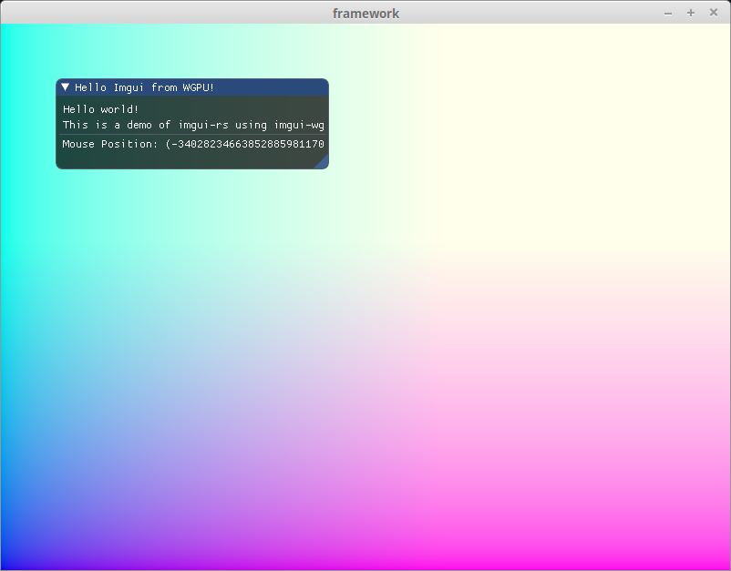

# Basic Imgui Demo

<div class="warning">

This example is currently broken for 0.8. Some of the dependecies used are still on wgpu 0.7 which causes some dependency conflicts. Once the `imgui-wgpu` crate has been updated to use wgpu 0.8 I'll update the dependencies and remove this warning.

</div>

This is not an in depth guid on how to use Imgui. But here are some of the basics you'll need to get started. We'll need to import [imgui-rs](https://docs.rs/imgui), [imgui-wgpu](https://docs.rs/imgui-wgpu), and [imgui-winit-support](https://docs.rs/imgui-winit-support).

```toml
imgui = "0.7"
imgui-wgpu = "0.14"
imgui-winit-support = "0.7"
```

<div class="note">

I've excluded some dependencies for brevity. I'm also using the [framework crate](https://github.com/sotrh/learn-wgpu/tree/master/code/showcase/framework) I've created for showcases to simplify setup. If you see a `display` variable in code, it's from the `framework`. `Display` is where the the `device`, `queue`, `swap_chain`, and other basic wgpu objects are stored.

</div>

We need to setup imgui and a `WinitPlatform` to get started. Do this after creating you're `winit::Window`.

```rust
let mut imgui = imgui::Context::create();
let mut platform = imgui_winit_support::WinitPlatform::init(&mut imgui);
platform.attach_window(
    imgui.io_mut(), 
    &display.window,
    imgui_winit_support::HiDpiMode::Default,
);
imgui.set_ini_filename(None);
```

Now we need to configure the default font. We'll using the window's scale factor to keep things from being too big or small.

```rust
let hidpi_factor = display.window.scale_factor();
let font_size = (13.0 * hidpi_factor) as f32;
imgui.io_mut().font_global_scale = (1.0 / hidpi_factor) as f32;
imgui.fonts().add_font(&[FontSource::DefaultFontData {
    config: Some(imgui::FontConfig {
        oversample_h: 1,
        pixel_snap_h: true,
        size_pixels: font_size,
        ..Default::default()
    }),
}]);
```

Then you need to create the renderer. We need to use the surface's `TextureFormat` in order for things to work properly.

```rust
let renderer_config = RendererConfig {
    texture_format: display.config.format,
    ..Default::default()
};
let renderer = Renderer::new(&mut imgui, &display.device, &display.queue, renderer_config);
```

When we update the scene, we'll need to update imgui.

```rust
self.imgui.io_mut().update_delta_time(dt); // dt: std::time::Duration
```

I'm not an expert with imgui, so I'll let the code speak for itself.

```rust
// Build the UI
self.platform
    .prepare_frame(self.imgui.io_mut(), &display.window)
    .expect("Failed to prepare frame!");
let ui = self.imgui.frame();
{
    let window = imgui::Window::new(im_str!("Hello Imgui from WGPU!"));
    window
        .size([300.0, 100.0], Condition::FirstUseEver)
        .build(&ui, || {
            ui.text(im_str!("Hello world!"));
            ui.text(im_str!("This is a demo of imgui-rs using imgui-wgpu!"));
            ui.separator();
            let mouse_pos = ui.io().mouse_pos;
            ui.text(im_str!(
                "Mouse Position: ({:.1}, {:.1})",
                mouse_pos[0],
                mouse_pos[1],
            ));
        });
}

// Prepare to render
let mut encoder = display.device.create_command_encoder(&Default::default());
let output = match display.swap_chain.get_current_frame() {
    Ok(frame) => frame,
    Err(e) => {
        eprintln!("Error getting frame: {:?}", e);
        return;
    }
}.output;

// Render the scene
self.canvas.render(
    &display.queue, 
    &mut encoder, 
    &output.view, 
    display.config.width as f32, 
    display.config.height as f32
);

// Render the UI
if self.last_cursor != ui.mouse_cursor() {
    self.last_cursor = ui.mouse_cursor();
    self.platform.prepare_render(&ui, &display.window);
}

let mut pass = encoder.begin_render_pass(&wgpu::RenderPassDescriptor {
    label: Some("UI RenderPass"),
    color_attachments: &[wgpu::RenderPassColorAttachment {
                    view: &view,
        attachment: &output.view,
        resolve_target: None,
        ops: wgpu::Operations {
            load: wgpu::LoadOp::Load,
            store: true,
        },
    }],
    depth_stencil_attachment: None,
});
self.renderer
    .render(ui.render(), &display.queue, &display.device, &mut pass)
    .expect("Failed to render UI!");
drop(pass);

display.queue.submit(Some(encoder.finish()));
```

That's all there is to it. Here's a picture of the results!



<AutoGithubLink/>